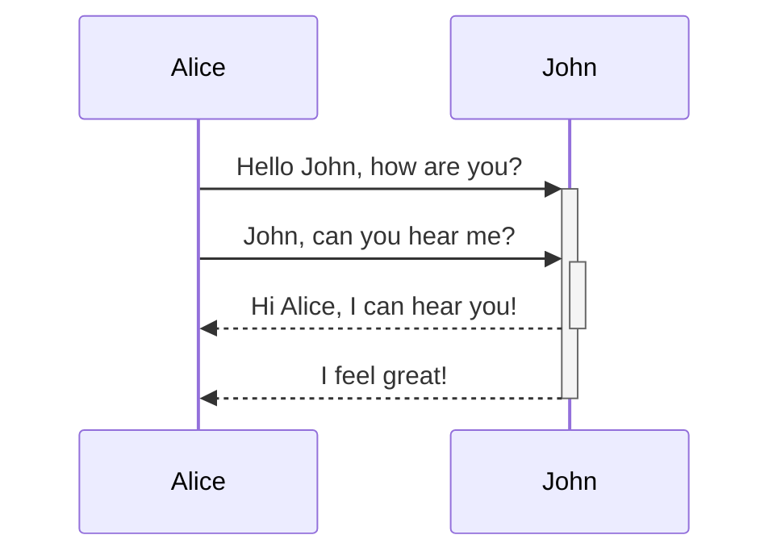

> [!SUMMARY] SuskrTyan

---

> [!Note] SuskrTyan

> [!Warning] SuskrTyan

```HTML
<h1>SuskrTyan</h1>
```

> [!FAQ] SuskrTyan

```CSS
.callout[data-callout="my-callout-type"] {
    --callout-color: 0, 0, 0;
    --callout-icon: icon-id;
    --callout-icon: '<svg>...custom svg...</svg>';
}
```

> [!TIP] SuskrTyan

> [!INFO] SuskrTyan

SuskrTyan[^1]

[^1]:SuskrTyan

==SuskrTyan==


`SuskrTyan`

[[SuskrTyan]]

[SuskrTyan](https://acg,com/)

$$\begin{vmatrix}a & b\\
c & d
\end{vmatrix}=ad-bc$$
$e^{2i\pi} = 1$

SuskrTyan | SuskrTyan
:--------- | ---------:
SuskrTyanSuskrTyan | SuskrTyanSuskrTyan

SuskrTyan | SuskrTyan
--- | ---
SuskrTyanSuskrTyan | SuskrTyanSuskrTyan

+ [x] SuskrTyan
+ [?] SuskrTyan
+ [ ] SuskrTyan



<pre><code>```mermaid
sequenceDiagram
    Alice->>+John: Hello John, how are you?
    Alice->>+John: John, can you hear me?
    John-->>-Alice: Hi Alice, I can hear you!
    John-->>-Alice: I feel great!
```</code></pre>

![[一些有趣的]]


